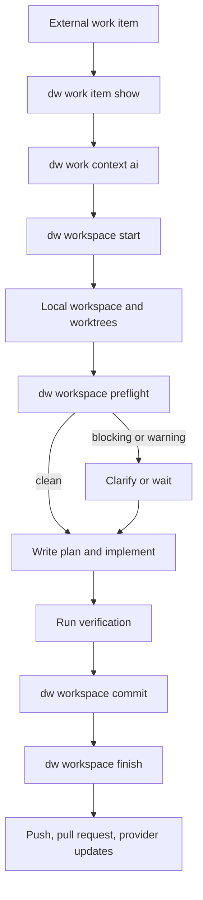

[English](README.md) | [Français](README.fr.md)

# dw

`dw` est l'interface en ligne de commande Dev Workflow. Elle sert au travail assisté par IA avec des fournisseurs externes, des espaces de travail Git locaux, des projets multidépôts, le contexte des agents et l'inspection contrôlée des sources de données.

L'interface en ligne de commande fournit un cadre déterministe. Les agents d'IA continuent de raisonner et de modifier les fichiers. `dw` rend prévisibles les interactions avec les fournisseurs, l'état du workflow, l'organisation du système de fichiers, les opérations Git, l'accès aux données et les mécanismes de publication et de mise à jour.

## Compilation

La compilation depuis les sources nécessite Go 1.26.2 ou une version ultérieure. Git doit être disponible dans `PATH` :

```bash
go run ./cmd/dw version
go fmt ./...
go test ./...
go vet ./...
go tool staticcheck ./...
go tool govulncheck ./...
go build -o ./dw ./cmd/dw
```

Avec Nix :

```bash
nix develop
nix run . -- version
nix run .#check
nix build .#default
```

`VERSION` contient la version de publication. La version complète utilisée pendant l'exécution suit ce format :

```text
Dev Workflow YYYY.MM.DD.N+COMMIT
```

## Installation

Les binaires publiés prennent en charge Linux x64 et Windows x64. Les opérations sur les dépôts et les worktrees nécessitent Git pendant l'exécution. macOS n'est pas pris en charge.

### Nix

Exécutez l'interface en ligne de commande sans l'installer :

```bash
nix run github:sachahjkl/dw -- version
nix run github:sachahjkl/dw -- doctor
```

Si nécessaire, actualisez vers la dernière révision poussée :

```bash
nix run --refresh github:sachahjkl/dw -- version
```

Pour une utilisation répétée, installez-la dans votre profil Nix :

```bash
nix profile install github:sachahjkl/dw
dw version
```

Mettez à niveau une installation du profil :

```bash
nix profile upgrade github:sachahjkl/dw
```

`dw upgrade` est désactivé pour les installations gérées par Nix. Utilisez plutôt `nix run --refresh ...` ou `nix profile upgrade ...`.

### Binaires publiés

Sous Windows, installez la dernière publication GitHub :

```powershell
irm https://raw.githubusercontent.com/sachahjkl/dw/master/scripts/install.ps1 | iex
# or:
iwr https://raw.githubusercontent.com/sachahjkl/dw/master/scripts/install.ps1 -UseBasicParsing | iex
```

Sous Linux ou WSL, installez la dernière publication GitHub :

```bash
curl -fsSL https://raw.githubusercontent.com/sachahjkl/dw/master/scripts/install.sh | sh
```

Emplacements d'installation par défaut :

```text
Windows: %LOCALAPPDATA%\DevWorkflow\bin
Linux/WSL: ~/.local/bin
```

Les programmes d'installation mettent à jour le `PATH` du profil ou du shell utilisateur. Les options `-NoPathUpdate` et `--no-path-update` désactivent cette action.

Vous pouvez aussi télécharger les fichiers manuellement depuis GitHub Releases :

- `dw-linux-x64.tar.gz`
- `dw-win-x64.zip`

Pour une installation par binaire publié, `dw upgrade --check` examine le dernier manifeste. `dw upgrade` met à jour le binaire actuel.

### Compilation locale

Compilez et exécutez le binaire depuis les sources avec Go 1.26.2 ou une version ultérieure :

```bash
go build -o ./dw ./cmd/dw
./dw version
```

Générez les artefacts de publication locaux :

```bash
VERSION="$(cat VERSION)" COMMIT="$(git rev-parse --short HEAD)" bash ./scripts/publish-linux-x64.sh
```

```powershell
$Version = Get-Content .\VERSION
$Commit = git rev-parse --short HEAD
powershell -ExecutionPolicy Bypass -File .\scripts\publish-win-x64.ps1 -Version $Version -Commit $Commit
```

## Commandes principales

- `dw work item list|show|doing|state set|child create` : opérations sur les éléments de travail, indépendantes du fournisseur.
- `dw work pr list` : demandes de tirage du fournisseur de travail sélectionné.
- `dw work context show|ai` et `dw work changelog` : contexte et journal des modifications indépendants du fournisseur.
- `dw workspace status|list|current|open|start|preflight|sync|rename|commit|finish|teardown|prune` : cycle de vie de l'espace de travail local et de Git.
- `dw workspace pr start`, `dw workspace repo add|latest`, `dw workspace item add|remove` et `dw workspace handoff validate` : opérations groupées sur l'espace de travail local.
- `dw data source list|collect` : détection et collecte des sources de données configurées.
- `dw data guard|catalog|describe|query` : accès générique et contrôlé aux données.
- `dw provider list|show|capabilities` : inspection des fournisseurs enregistrés statiquement et de leurs opérations prises en charge.
- `dw provider auth login|status|logout <provider>` : authentification auprès du fournisseur de travail sélectionné.
- `dw agent open|config|default set` : lancement d'un agent, création de sa configuration et sélection de l'agent par défaut.
- `dw config show|doctor|root set|color set` : inspection et mise à jour de la configuration locale.
- `dw secret list|get|set|delete` : inventaire et stockage des secrets locaux.
- `dw init`, `dw doctor` et `dw upgrade --check` : configuration de la racine, contrôle de l'état et gestion des publications.

Les commandes de travail acceptent l'option `--provider`. Sans cette option, elles utilisent le fournisseur de travail configuré pour le projet. La configuration d'une source de données nomme son fournisseur. Les commandes génériques de données le sélectionnent avec `--source`. Elles acceptent `RESOURCE` quand il est nécessaire. Elles reçoivent la requête avec `--query` ou avec les valeurs `QUERY` finales. Les commandes de données concernées acceptent aussi `--provider`. L'authentification sélectionne toujours le fournisseur par sa position. Avant une opération, `dw provider capabilities <provider>` affiche les interfaces facultatives fournies par le fournisseur.

## Configuration d'exécution

DevWorkflow crée `runtime.json` dans le répertoire de configuration de l'utilisateur. Modifiez ce fichier JSON pour changer les limites d'exécution, HTTP, de session, d'interrogation et du service web.

Sous Linux, le chemin est `$XDG_CONFIG_HOME/DevWorkflow/runtime.json`. La base par défaut est `~/.config`. Sous Windows, le chemin est `%LOCALAPPDATA%\DevWorkflow\runtime.json`.

Le fichier utilise le schéma `1`. DevWorkflow rejette les champs inconnus et les valeurs incorrectes. Il n'applique pas de paramètres partiels.

## Artefacts de publication

Générez les artefacts de publication locaux :

```bash
VERSION="$(cat VERSION)" COMMIT="$(git rev-parse --short HEAD)" bash ./scripts/publish-linux-x64.sh
```

```powershell
$Version = Get-Content .\VERSION
$Commit = git rev-parse --short HEAD
powershell -ExecutionPolicy Bypass -File .\scripts\publish-win-x64.ps1 -Version $Version -Commit $Commit
```

L'artefact Linux est écrit dans :

```text
artifacts/linux-x64/dw-linux-x64.tar.gz
```

L'artefact Windows est écrit dans :

```text
artifacts/win-x64/dw-win-x64.zip
```

Les workflows de publication produisent aussi `release.json`. `dw upgrade --check` et `dw upgrade` utilisent ce fichier.

## Intégration continue et publications

GitHub Actions utilise Go 1.26 et Nix pour effectuer les opérations suivantes :

- contrôler le formatage, exécuter `go test ./...` et exécuter `go vet ./...`
- appliquer les limites entre les dépendances des paquets définies par le contrôle d'architecture Nix
- compiler et tester rapidement les artefacts Linux x64 et Windows x64 sans CGO
- valider le paquet Nix sous Linux
- publier `dw-linux-x64.tar.gz`, `dw-win-x64.zip` et leur manifeste commun `release.json` quand une publication est activée

Chaque archive de plateforme contient un seul exécutable autonome : `dw` sous Linux ou `dw.exe` sous Windows. Aucun artefact macOS n'est fourni.

## Organisation du dépôt

```text
cmd/dw/             process entry point
internal/           application, provider, CLI, console, TUI, and platform packages
locales/            embedded English localization catalog
schemas/            JSON schemas copied into DevWorkflow roots
scripts/            Linux and Windows x64 release pipelines
```

L'exécutable utilise des registres statiques et ordonnés pour les fournisseurs de travail et de données. Les rapports sur les fournisseurs proviennent de ces registres et des interfaces de capacité. Ils ne reposent pas sur une liste de produits codée en dur. Azure DevOps est l'implémentation de travail actuelle. GitHub et Jira peuvent utiliser les mêmes contrats de travail. SQL Server est l'implémentation de données actuelle. SQLite, Excel et les sources NoSQL peuvent implémenter les fonctions de données concernées. L'interface interactive utilise Charm v2. Le texte de l'interface en ligne de commande, de la TUI et de la console passe par la couche de localisation anglaise dans `internal/l10n`.

## Workflow

Le déroulement complet prévu est le suivant :

1. Inspectez le fournisseur du projet avec `dw provider show <provider>` ou `dw provider capabilities <provider>`.
2. Si nécessaire, authentifiez-vous avec `dw provider auth login <provider>`.
3. Lisez le travail externe avec `dw work item show ...` et `dw work context ai ...`.
4. Créez ou reprenez l'état local avec `dw workspace start ...` ou `dw workspace open ...`.
5. Exécutez `dw workspace preflight --continue` avant l'implémentation ou la création d'un enfant.
6. Implémentez et vérifiez les modifications. Utilisez ensuite `dw workspace commit` et `dw workspace finish`.


