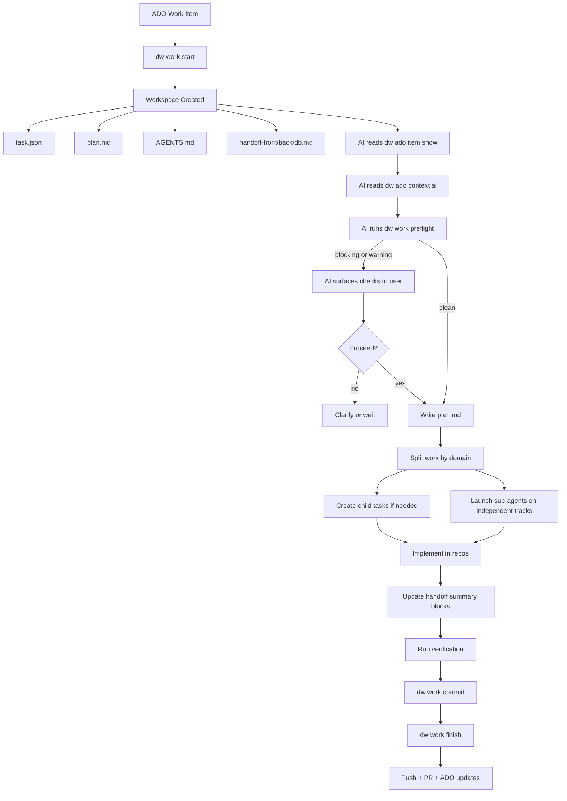

# dw

`dw` is the Dev Workflow CLI for AI-assisted work across Azure DevOps, Git worktrees, multi-repository projects, agent context, and read-only SQL Server introspection.

The CLI is the deterministic rail. AI agents still do the reasoning and editing, but `dw` keeps workflow state, filesystem layout, Git operations, ADO context, database access, and release/update mechanics predictable.

## Build

Source builds require Go 1.26 and Git on `PATH`:

```bash
go run ./cmd/dw version
go fmt ./...
go test ./...
go vet ./...
go build -o ./dw ./cmd/dw
```

With Nix:

```bash
nix develop
nix run . -- version
nix run .#check
nix build .#default
```

`VERSION` is the release version source. The full runtime version is rendered as:

```text
Dev Workflow YYYY.MM.DD.N+COMMIT
```

## Install

Release binaries support Linux x64 and Windows x64. Git is a runtime prerequisite for repository and worktree operations. macOS is not supported.

### Nix

Run the CLI without installing it:

```bash
nix run github:sachahjkl/dw -- version
nix run github:sachahjkl/dw -- doctor
```

Refresh to the latest pushed revision when needed:

```bash
nix run --refresh github:sachahjkl/dw -- version
```

Install it into your Nix profile for repeated use:

```bash
nix profile install github:sachahjkl/dw
dw version
```

Upgrade a profile install:

```bash
nix profile upgrade github:sachahjkl/dw
```

`dw upgrade` is disabled for Nix-managed installs. Use `nix run --refresh ...` or `nix profile upgrade ...` instead.

### Release Binaries

Windows install from the latest GitHub release:

```powershell
irm https://raw.githubusercontent.com/sachahjkl/dw/master/scripts/install.ps1 | iex
# or:
iwr https://raw.githubusercontent.com/sachahjkl/dw/master/scripts/install.ps1 -UseBasicParsing | iex
```

Linux/WSL install from the latest GitHub release:

```bash
curl -fsSL https://raw.githubusercontent.com/sachahjkl/dw/master/scripts/install.sh | sh
```

Default install locations:

```text
Windows: %LOCALAPPDATA%\DevWorkflow\bin
Linux/WSL: ~/.local/bin
```

The installers update the user shell/profile PATH unless `-NoPathUpdate` or `--no-path-update` is passed.

Manual downloads are also available from GitHub Releases:

- `dw-linux-x64.tar.gz`
- `dw-win-x64.zip`

For release-binary installs, `dw upgrade --check` can inspect the latest release manifest and `dw upgrade` updates the current binary.

### Local Build

Build and run the binary from source with Go 1.26:

```bash
go build -o ./dw ./cmd/dw
./dw version
```

Build local release artifacts:

```bash
VERSION="$(cat VERSION)" COMMIT="$(git rev-parse --short HEAD)" bash ./scripts/publish-linux-x64.sh
```

```powershell
$Version = Get-Content .\VERSION
$Commit = git rev-parse --short HEAD
powershell -ExecutionPolicy Bypass -File .\scripts\publish-win-x64.ps1 -Version $Version -Commit $Commit
```

## Main Commands

- `dw init`: create/update a DevWorkflow root with config, schemas and templates.
- `dw doctor`: inspect environment/configuration health.
- `dw auth login/status/logout`: Azure DevOps auth through OAuth/keyring or PAT fallback.
- `dw ado assigned/prs/changelog`, `dw ado item show`, `dw ado state set`, `dw ado context show/ai`: Azure DevOps workflows.
- `dw db list/collect/guard/schema/describe/query`: SQL Server discovery and readonly helpers.
- `dw work start/open/list/current/status/sync/rename/preflight/commit/finish/teardown/prune`: workspace lifecycle.
- `dw work item doing/add/remove`, `dw work repo add/latest`, `dw work pr start`, `dw work handoff validate`, `dw work task child create`: grouped workspace operations.
- `dw agent open/config/default set`: agent launch, workspace config generation, and default selection.
- `dw config show/doctor/root set/color set`: local configuration inspection and updates.
- `dw secret list/get/set/delete`: local secret inventory and storage.
- `dw upgrade --check`: release manifest check for binary installs.

## Release Artifacts

Build local release artifacts:

```bash
VERSION="$(cat VERSION)" COMMIT="$(git rev-parse --short HEAD)" bash ./scripts/publish-linux-x64.sh
```

```powershell
$Version = Get-Content .\VERSION
$Commit = git rev-parse --short HEAD
powershell -ExecutionPolicy Bypass -File .\scripts\publish-win-x64.ps1 -Version $Version -Commit $Commit
```

The Linux artifact is written to:

```text
artifacts/linux-x64/dw-linux-x64.tar.gz
```

The Windows artifact is written to:

```text
artifacts/win-x64/dw-win-x64.zip
```

Release workflows also produce `release.json`, consumed by `dw upgrade --check` and `dw upgrade`.

## CI and Releases

GitHub Actions uses Go 1.26 and Nix to:

- check formatting, run `go test ./...`, and run `go vet ./...`
- enforce the package dependency boundaries defined by the Nix architecture check
- build and smoke-test CGO-disabled Linux x64 and Windows x64 artifacts
- validate the Nix package on Linux
- publish `dw-linux-x64.tar.gz`, `dw-win-x64.zip`, and their combined `release.json` manifest when a release is enabled

Each platform archive contains one standalone executable: `dw` on Linux or `dw.exe` on Windows. There is no macOS artifact.

## Repository Layout

```text
cmd/dw/             process entry point
internal/           application, provider, CLI, console, TUI, and platform packages
locales/            embedded English localization catalog
schemas/            JSON schemas copied into DevWorkflow roots
scripts/            Linux and Windows x64 release pipelines
```

The executable is composed from statically registered, capability-based providers. Azure DevOps is the current work provider and SQL Server is the current data provider. The provider contracts permit future GitHub or Jira work providers and SQLite, Excel, or NoSQL data providers without changing command orchestration. The interactive interface uses Charm v2; CLI, TUI, and console text crosses the English localization bridge in `internal/l10n`.

## Workflow

The intended end-to-end flow is:

1. `dw work start ...` creates the workspace, agent files and handoffs.
2. The AI reads `dw ado item show` and `dw ado context ai`.
3. The AI runs `dw work preflight --continue` before implementation or child-task creation.
4. The plan is written in `plan.md` and split by domain when useful.
5. Domain handoffs such as `handoff-front.md`, `handoff-back.md`, `handoff-db.md` guide sub-agents.
6. The AI implements, verifies, commits with `dw work commit`, then finishes with `dw work finish`.


