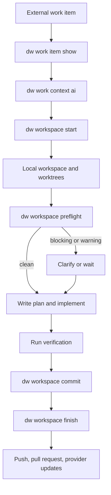

# dw

`dw` is the Dev Workflow CLI for AI-assisted work across external work providers, local Git workspaces, multi-repository projects, agent context, and guarded data-source inspection.

The CLI is the deterministic rail. AI agents still do the reasoning and editing, but `dw` keeps provider interaction, workflow state, filesystem layout, Git operations, data access, and release/update mechanics predictable.

## Build

Source builds require Go 1.26 and Git on `PATH`:

```bash
go run ./cmd/dw version
go fmt ./...
go test ./...
go vet ./...
go build -o ./dw ./cmd/dw
```

With Nix:

```bash
nix develop
nix run . -- version
nix run .#check
nix build .#default
```

`VERSION` is the release version source. The full runtime version is rendered as:

```text
Dev Workflow YYYY.MM.DD.N+COMMIT
```

## Install

Release binaries support Linux x64 and Windows x64. Git is a runtime prerequisite for repository and worktree operations. macOS is not supported.

### Nix

Run the CLI without installing it:

```bash
nix run github:sachahjkl/dw -- version
nix run github:sachahjkl/dw -- doctor
```

Refresh to the latest pushed revision when needed:

```bash
nix run --refresh github:sachahjkl/dw -- version
```

Install it into your Nix profile for repeated use:

```bash
nix profile install github:sachahjkl/dw
dw version
```

Upgrade a profile install:

```bash
nix profile upgrade github:sachahjkl/dw
```

`dw upgrade` is disabled for Nix-managed installs. Use `nix run --refresh ...` or `nix profile upgrade ...` instead.

### Release Binaries

Windows install from the latest GitHub release:

```powershell
irm https://raw.githubusercontent.com/sachahjkl/dw/master/scripts/install.ps1 | iex
# or:
iwr https://raw.githubusercontent.com/sachahjkl/dw/master/scripts/install.ps1 -UseBasicParsing | iex
```

Linux/WSL install from the latest GitHub release:

```bash
curl -fsSL https://raw.githubusercontent.com/sachahjkl/dw/master/scripts/install.sh | sh
```

Default install locations:

```text
Windows: %LOCALAPPDATA%\DevWorkflow\bin
Linux/WSL: ~/.local/bin
```

The installers update the user shell/profile PATH unless `-NoPathUpdate` or `--no-path-update` is passed.

Manual downloads are also available from GitHub Releases:

- `dw-linux-x64.tar.gz`
- `dw-win-x64.zip`

For release-binary installs, `dw upgrade --check` can inspect the latest release manifest and `dw upgrade` updates the current binary.

### Local Build

Build and run the binary from source with Go 1.26:

```bash
go build -o ./dw ./cmd/dw
./dw version
```

Build local release artifacts:

```bash
VERSION="$(cat VERSION)" COMMIT="$(git rev-parse --short HEAD)" bash ./scripts/publish-linux-x64.sh
```

```powershell
$Version = Get-Content .\VERSION
$Commit = git rev-parse --short HEAD
powershell -ExecutionPolicy Bypass -File .\scripts\publish-win-x64.ps1 -Version $Version -Commit $Commit
```

## Main Commands

- `dw work item list|show|doing|state set|child create`: provider-neutral work-item operations.
- `dw work pr list`: pull requests from the selected work provider.
- `dw work context show|ai` and `dw work changelog`: provider-neutral context and changelog output.
- `dw workspace status|list|current|open|start|preflight|sync|rename|commit|finish|teardown|prune`: local workspace and Git lifecycle.
- `dw workspace pr start`, `dw workspace repo add|latest`, `dw workspace item add|remove`, and `dw workspace handoff validate`: grouped local workspace operations.
- `dw data source list|collect`: configured data-source discovery and collection.
- `dw data guard|catalog|describe|query`: generic guarded data access.
- `dw provider list|show|capabilities`: inspect statically registered providers and their supported operations.
- `dw provider auth login|status|logout <provider>`: authenticate a selected work provider.
- `dw agent open|config|default set`: agent launch, workspace config generation, and default selection.
- `dw config show|doctor|root set|color set`: local configuration inspection and updates.
- `dw secret list|get|set|delete`: local secret inventory and storage.
- `dw init`, `dw doctor`, and `dw upgrade --check`: root setup, health, and release management.

Work commands accept optional `--provider`; otherwise the configured project work provider is used. Data-source configuration names its provider; generic data commands select it with `--source`, accept `RESOURCE` where needed, and take query text through `--query` or trailing `QUERY` values. Applicable data commands also accept `--provider`. Authentication always selects the provider positionally. `dw provider capabilities <provider>` shows which optional interfaces the provider implements before an operation is attempted.

## Release Artifacts

Build local release artifacts:

```bash
VERSION="$(cat VERSION)" COMMIT="$(git rev-parse --short HEAD)" bash ./scripts/publish-linux-x64.sh
```

```powershell
$Version = Get-Content .\VERSION
$Commit = git rev-parse --short HEAD
powershell -ExecutionPolicy Bypass -File .\scripts\publish-win-x64.ps1 -Version $Version -Commit $Commit
```

The Linux artifact is written to:

```text
artifacts/linux-x64/dw-linux-x64.tar.gz
```

The Windows artifact is written to:

```text
artifacts/win-x64/dw-win-x64.zip
```

Release workflows also produce `release.json`, consumed by `dw upgrade --check` and `dw upgrade`.

## CI and Releases

GitHub Actions uses Go 1.26 and Nix to:

- check formatting, run `go test ./...`, and run `go vet ./...`
- enforce the package dependency boundaries defined by the Nix architecture check
- build and smoke-test CGO-disabled Linux x64 and Windows x64 artifacts
- validate the Nix package on Linux
- publish `dw-linux-x64.tar.gz`, `dw-win-x64.zip`, and their combined `release.json` manifest when a release is enabled

Each platform archive contains one standalone executable: `dw` on Linux or `dw.exe` on Windows. There is no macOS artifact.

## Repository Layout

```text
cmd/dw/             process entry point
internal/           application, provider, CLI, console, TUI, and platform packages
locales/            embedded English localization catalog
schemas/            JSON schemas copied into DevWorkflow roots
scripts/            Linux and Windows x64 release pipelines
```

The executable is composed from ordered, static work and data provider registries. Provider reports are derived from those registries and capability interfaces rather than a hardcoded product list. Azure DevOps is the current work implementation; GitHub and Jira can be added behind the same work contracts. SQL Server is the current data implementation; SQLite, Excel, and NoSQL sources can implement the relevant data capabilities. The interactive interface uses Charm v2; CLI, TUI, and console text crosses the English localization bridge in `internal/l10n`.

## Workflow

The intended end-to-end flow is:

1. Inspect the project provider with `dw provider show <provider>` or `dw provider capabilities <provider>`.
2. Authenticate when needed with `dw provider auth login <provider>`.
3. Read external work with `dw work item show ...` and `dw work context ai ...`.
4. Create or resume local state with `dw workspace start ...` or `dw workspace open ...`.
5. Run `dw workspace preflight --continue` before implementation or child creation.
6. Implement and verify, then use `dw workspace commit` and `dw workspace finish`.


