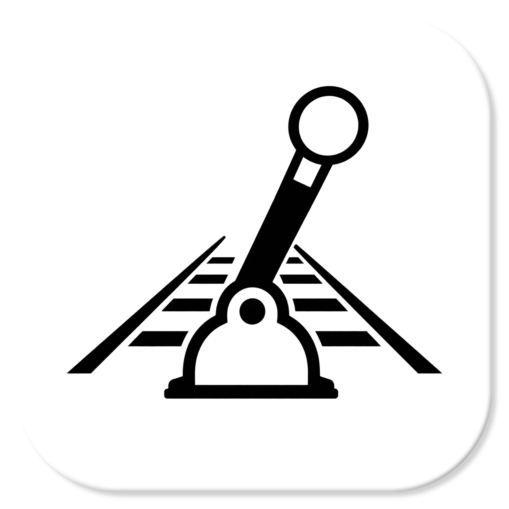
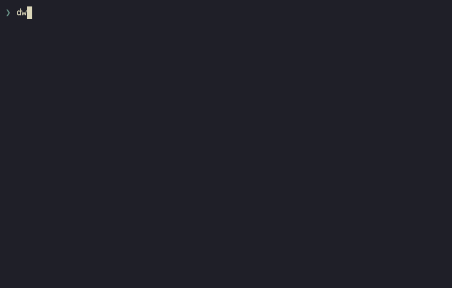
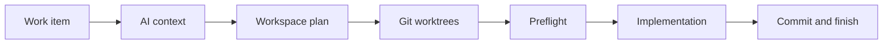

<div align="center">



# dw

**Deterministic rails for AI-assisted development.**

[](https://github.com/sachahjkl/dw/releases/latest)
[](https://github.com/sachahjkl/dw/actions/workflows/ci.yml)
[](https://go.dev/)
[](LICENSE)

[Install](#install) · [Quick start](#quick-start) · [Workflow](#workflow) · [Commands](#commands) · [Demo](#demo)

</div>

---

`dw` connects external work items, local Git workspaces, AI-agent context, and
guarded data access through one predictable CLI.

AI agents still reason and edit. `dw` owns the repeatable parts: provider
interaction, workspace layout, Git operations, workflow state, and release
mechanics.

```console
$ dw work context ai 142
$ dw workspace start 142
$ dw workspace preflight --continue
```

## Why dw?

| | |
|---|---|
| **Provider-neutral work** | Read and update work items without binding the workflow to one tracker. |
| **Isolated workspaces** | Create repeatable branches, worktrees, repositories, and handoff state. |
| **Agent-ready context** | Generate deterministic context before an agent starts reasoning. |
| **Guarded data access** | Inspect SQL Server, SQLite, CSV, and Excel through explicit read policies. |
| **Preview before mutation** | Review plans first, then opt into execution with `--execute`. |
| **One operational surface** | Use the CLI, interactive TUI, or local web interface over the same actions. |

## Demo

Preview a Dev Workflow root, then inspect the capabilities of the GitHub work
provider.

<p align="center">
  <a href="docs/demo.cast">
    
  </a>
</p>

The animation comes from the committed [asciinema recording](docs/demo.cast).

## Quick start

```sh
dw doctor
dw init
dw provider auth login github
dw work item list --project owner/repository
```

Start work from an external item:

```sh
dw work item show 142
dw work context ai 142
dw workspace start 142
dw workspace open --continue
```

Workspace commands preview destructive or remote changes by default. Add
`--execute` only after you review the plan.

## Install

### Nix

Run without installing:

```sh
nix run github:sachahjkl/dw -- version
nix run github:sachahjkl/dw -- doctor
```

Install into your profile:

```sh
nix profile install github:sachahjkl/dw
```

### Linux and WSL

```sh
curl -fsSL https://raw.githubusercontent.com/sachahjkl/dw/master/scripts/install.sh | sh
```

### Windows PowerShell

```powershell
irm https://raw.githubusercontent.com/sachahjkl/dw/master/scripts/install.ps1 | iex
```

Release binaries support Linux x64 and Windows x64. Git is a runtime
prerequisite. macOS is not currently supported.

Release-binary installations can update themselves:

```sh
dw upgrade --check
dw upgrade
```

Use `nix profile upgrade github:sachahjkl/dw` for Nix-managed installations.

## Workflow


```mermaid
flowchart LR
    A[Work item] --> B[AI context]
    B --> C[Workspace plan]
    C --> D[Git worktrees]
    D --> E[Preflight]
    E --> F[Implementation]
    F --> G[Commit and finish]
```

The daily path stays explicit:

1. Inspect the work item with `dw work item show`.
2. Generate context with `dw work context ai`.
3. Create or resume a workspace with `dw workspace start`.
4. Validate it with `dw workspace preflight --continue`.
5. Implement and verify the change.
6. Commit with `dw workspace commit --continue`.
7. Finish with `dw workspace finish --continue`.

## Commands

### Work providers

```sh
dw provider list
dw provider show github
dw provider capabilities azure-devops
dw provider auth status github
dw work item list
dw work pr list
dw work changelog 142 143
```

Work providers currently include GitHub, Azure DevOps, and Atlassian. Optional
capabilities remain visible through `dw provider capabilities`.

### Workspaces

```sh
dw workspace status
dw workspace list
dw workspace current
dw workspace preflight --continue
dw workspace sync --continue
dw workspace repo add owner/repository
dw workspace handoff validate --continue
dw workspace finish --continue --execute
```

Workspace state groups related repositories, worktrees, work items, and agent
handoffs under one task directory.

### Guarded data

```sh
dw data source list
dw data catalog --source reporting
dw data describe customers --source reporting
dw data query --source reporting --query "select top 20 * from customers"
```

Each data provider defines its capabilities and read policy. Generic commands
do not bypass provider guards.

### Agents and interfaces

```sh
dw agent config
dw agent default set opencode
dw agent open
dw tui
dw web start
```

The CLI, TUI, and web interface use the same action contracts and execution
state.

## Configuration

`dw init` creates a Dev Workflow root containing configuration, schemas,
cache, projects, workspaces, and generated agent context.

Inspect or move the root:

```sh
dw config show
dw config doctor
dw config root set ~/dev/dw
dw refresh
```

Runtime limits live in `runtime.json`:

- Linux: `$XDG_CONFIG_HOME/DevWorkflow/runtime.json`
- Windows: `%LOCALAPPDATA%\DevWorkflow\runtime.json`

The configuration uses schema version `1`. Unknown fields and invalid values
cause a validation error.

## Safety model

`dw` separates planning from execution for workspace mutations. It also keeps
provider authentication explicit and stores local secrets through the platform
credential backend.

Release updates verify a signed manifest before replacing the current binary.
Data queries pass through the selected provider's read guard.

## Development

Enter the development environment:

```sh
nix develop
```

Run the complete checks:

```sh
nix run .#fmt
nix run .#test
nix run .#static-analysis
nix run .#architecture
nix flake check "path:$PWD" --no-write-lock-file
```

Source builds require Go 1.26.2 or later:

```sh
go build -o ./dw ./cmd/dw
./dw version
```

`VERSION` is the release version source. CI builds static Linux x64 and Windows
x64 binaries.

## Architecture

```text
cmd/dw/      Process entry point
internal/    Actions, providers, CLI, TUI, web, and domain packages
locales/     Embedded English localization catalog
schemas/     Dev Workflow root schemas
scripts/     Installers and release pipelines
```

Read the [architecture notes](docs/architecture/) for command contracts,
workspaces, providers, OpenCode integration, data access, and updates.

## License

`dw` is available under the [MIT License](LICENSE).
