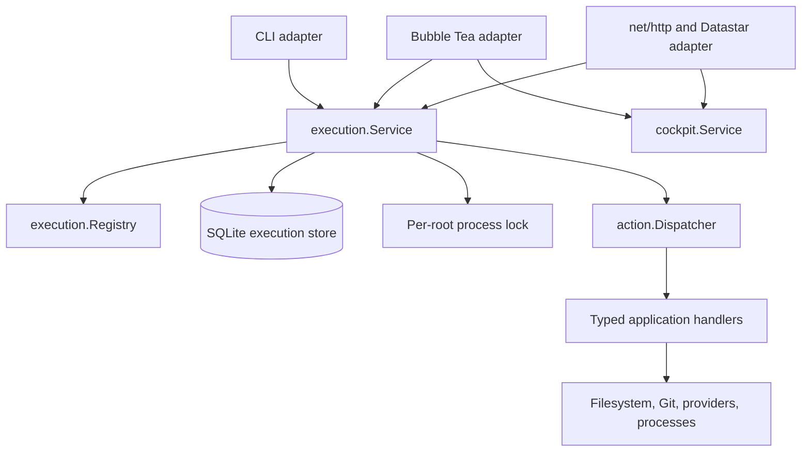
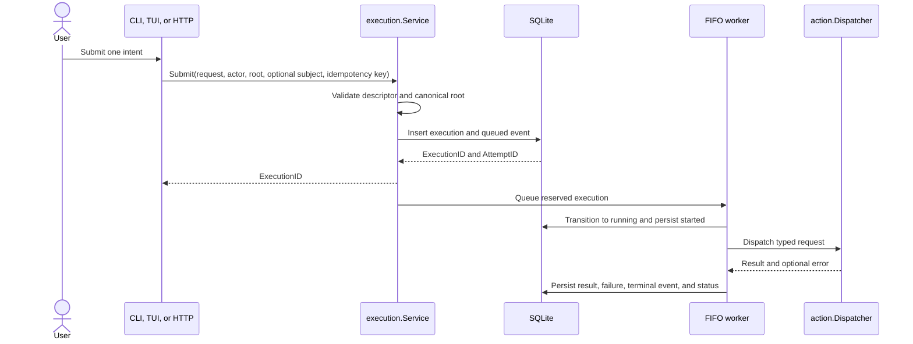
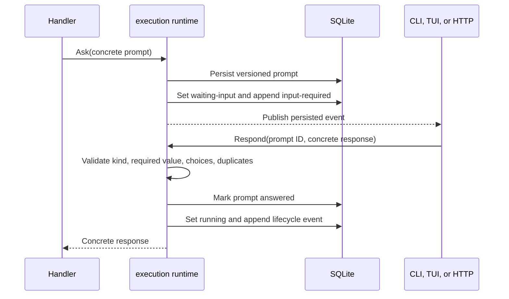
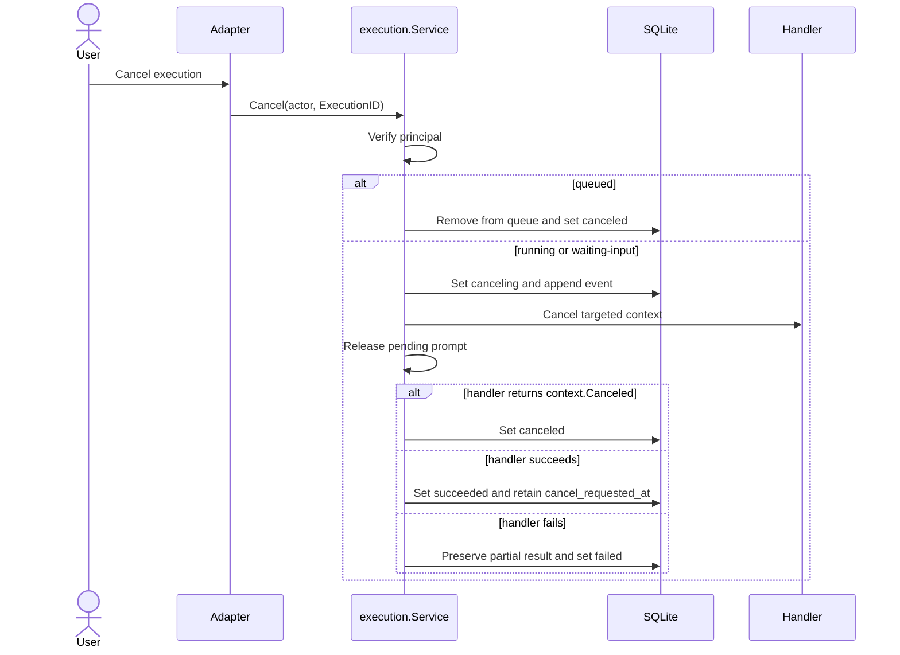
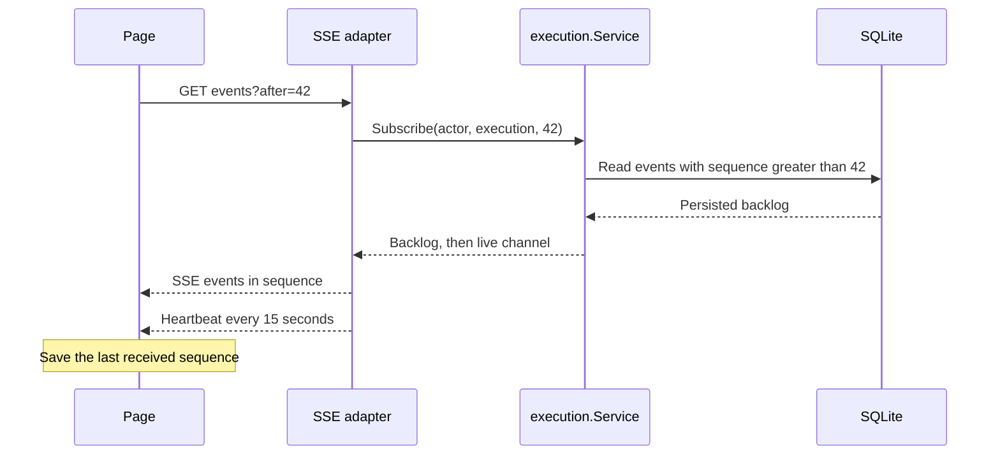
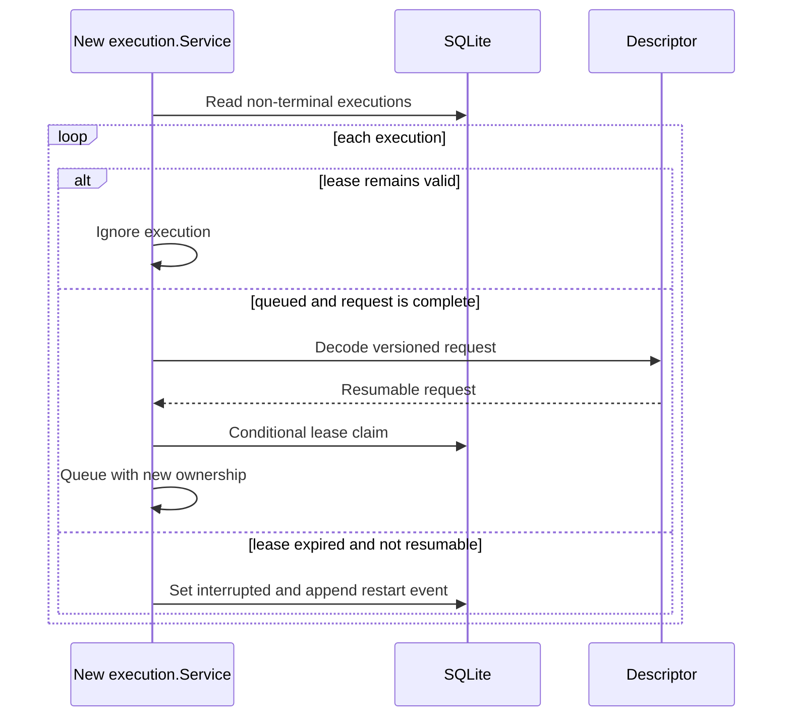

# Execution and Local Web Architecture

Status: accepted

Consulted: 2026-08-02

## Decision

DevWorkflow uses one typed, persistent execution service for every business action.



The only action path is:

```text
CLI / TUI / HTTP -> execution.Service -> action.Dispatcher -> handlers
```

`execution.Service` owns the FIFO queue, execution identity, attempts, lifecycle, prompts, cancellation, event sequence, persistence, leases, and subscriptions.

The dispatcher remains the typed business boundary. Handlers remain independent of CLI, TUI, HTTP, Datastar, templ, and service management.

No presentation owns a second `RunManager`, queue, prompt store, or execution history. CLI and TUI migrate completely to the shared service.

## Evidence and Priorities

The evidence remains in [`../action-execution-audit.md`](../action-execution-audit.md).

The audit found three separate mechanisms:

1. A synchronous typed dispatcher.
2. A TUI-only asynchronous queue and history.
3. Business operations that accept `context.Context`.

It also found these defects:

- The dispatcher discards a non-nil partial result when a handler returns an error.
- `workspace.finish` drops its event sink on the local execution path.
- The CLI does not convert process signals into targeted cancellation.
- The TUI has local run identifiers, a local queue, and a blocking final send.
- No interprocess lock protects workspace mutations.
- Prompt validation and event payload contracts are too permissive for HTTP.
- No durable lifecycle or restart policy exists.

Implementation follows this priority order:

1. Make action, prompt, response, and event contracts strict.
2. Preserve partial results and events.
3. Add the typed registry and one persistent executor.
4. Add per-root interprocess locking.
5. Migrate CLI and TUI without compatibility paths.
6. Add the local web service and Datastar presentation.

## Identity and Lifecycle

`action.ID` identifies an action type. It never identifies one execution.

The execution layer defines four 16-byte random identifiers:

- `ExecutorID` identifies one service instance.
- `ExecutionID` identifies one user submission.
- `AttemptID` identifies one execution attempt.
- `IdempotencyKey` identifies one user intent for one principal.

The service generates each identifier with `crypto/rand`. Text codecs use 32 lowercase hexadecimal characters.

An execution has one of these statuses:

```text
queued
running
waiting-input
canceling
canceled
succeeded
failed
interrupted
```

Only these transitions are valid:

```mermaid
stateDiagram-v2
    [*] --> queued
    queued --> running
    queued --> canceled
    queued --> interrupted
    running --> waiting-input
    running --> canceling
    running --> succeeded
    running --> failed
    running --> interrupted
    waiting-input --> running
    waiting-input --> canceling
    waiting-input --> interrupted
    canceling --> canceled
    canceling --> succeeded
    canceling --> failed
    canceling --> interrupted
```

`canceled`, `succeeded`, `failed`, and `interrupted` are terminal.

Every execution starts with event sequence `1` for `queued`. Only the execution service assigns later contiguous sequences.

Every attempt stores an ordinal. This design uses ordinal `1`; the schema permits a later explicit retry design.

## Submission and Idempotency



`Submit` requires a non-zero idempotency key. CLI and TUI generate one key for each user intent. The web server supplies the key with the form.

SQLite enforces uniqueness on `(principal, idempotency_key)`. An exact repeat requires the same action, root, request, and optional subject.

A process reserves its submission with its `ExecutorID` before `Submit` returns. One FIFO worker runs per process.

The service renews non-terminal leases every five seconds. A lease expires after fifteen seconds. Another process never claims an execution with a valid lease.

## Typed Persistence Boundary

Every action handler has exactly one registered descriptor. Dispatcher and descriptor identifier sets must match.

A descriptor:

- Encodes and decodes the exact request and result types.
- Rejects unknown JSON fields.
- Uses schema version `1` for current request and result DTOs.
- Computes the request lock mode.
- Marks sensitive or incomplete encodings as redacted and non-resumable.

All persisted struct fields have explicit JSON tags. No persistence or HTTP DTO uses `any`, `map[string]any`, or JSON decoding into `interface{}`.

`secret.SetRequest` never persists `SecretValue`. Its descriptor stores only the key and source, sets `Redacted=true`, and makes the submission non-resumable.

Event data has a registered stable type and schema. Current handler payload discriminants are `work.event` and `update.event`, both at schema `1`.

Handlers emit only `progress`, `warning`, and `log`. The executor emits `queued`, `started`, `input-required`, `canceling`, `canceled`, `succeeded`, `failed`, and `interrupted`.

Localization persistence uses `MessageV1`. It stores schema `1`, one `l10n.ID`, and ordered typed arguments. Argument kinds are `string`, `integer`, `boolean`, and `decimal`. Persistence rejects every other localization value type.

An unclassified error persists code `execution.unclassified-error`. It never persists the raw error text.

## Prompt and Response Flow

The action runtime accepts a closed prompt sum:

- `TextPrompt`
- `SecretPrompt`
- `ConfirmPrompt`
- `SelectOnePrompt`
- `SelectManyPrompt`

Responses use five corresponding concrete types. The runtime validates the concrete type, required values, allowed choices, duplicate choices, and defaults.



Five distinct versioned DTOs encode prompts. Four distinct DTOs encode non-secret responses. The persisted prompt kind selects the response decoder; the client cannot choose it independently.

For a secret prompt, persistence stores only the type, identifier, and dates. It never stores the response or a derived value.

## Cancellation



CLI signal handling calls targeted `Cancel` before exit. TUI cancellation never closes the full application.

## Events, Reconnection, and Limits

The service persists every event before publication. A subscriber receives events after an explicit sequence.



Each subscriber uses the capacity from `runtime.json`. The service closes a slow subscriber with `execution.slow-subscriber`. The client reconnects from its last sequence.

`runtime.json` also controls event count, payload size, and terminal-record limits. The defaults are 10,000 events, 256 KiB, and 500 records.

The service reserves terminal event capacity. A terminal commit removes the oldest excess rows. It never removes a non-terminal execution.

## Restart and Recovery



A process never resumes a handler midway. Git, HTTP, and external processes do not expose a universal checkpoint.

An expired `queued` execution is requeued only when its descriptor decodes a complete, non-redacted request. Expired `running`, `waiting-input`, and `canceling` executions become `interrupted`.

`Close` rejects new submissions and cancels the active execution. Its timeout comes from `runtime.json`. It marks remaining non-terminal entries as `interrupted`.

## SQLite Store

The database never resides in a workspace.

- Linux: `PlatformBaseDirs.StateDir/DevWorkflow/execution-v1.sqlite`
- Windows: `PlatformBaseDirs.DataLocalDir/DevWorkflow/execution-v1.sqlite`

The connection enables `foreign_keys=ON`, `journal_mode=WAL`, and `busy_timeout=5000`. Schema version uses `PRAGMA user_version=1`.

All times use Unix UTC milliseconds. Identifier columns use 16-byte blobs. Request hashes use 32-byte SHA-256 blobs.

### `executions`

```text
execution_id BLOB(16) PRIMARY KEY
attempt_id BLOB(16) UNIQUE
action_id TEXT
request_schema INTEGER
request_json BLOB
request_redacted INTEGER
request_hash BLOB(32)
root TEXT
principal TEXT
origin TEXT
idempotency_key BLOB(16)
status TEXT
executor_id BLOB(16)
lease_expires_at INTEGER
resumable INTEGER
created_at INTEGER
started_at INTEGER
finished_at INTEGER
cancel_requested_at INTEGER
result_schema INTEGER
result_json BLOB
result_redacted INTEGER
error_code TEXT
error_message_json BLOB
UNIQUE(principal, idempotency_key)
```

### `attempts`

```text
attempt_id BLOB(16) PRIMARY KEY
execution_id BLOB(16) REFERENCES executions(execution_id) ON DELETE CASCADE
ordinal INTEGER
status TEXT
started_at INTEGER
finished_at INTEGER
```

### `events`

```text
execution_id BLOB(16) REFERENCES executions(execution_id) ON DELETE CASCADE
attempt_id BLOB(16)
sequence INTEGER
at INTEGER
kind TEXT
action_id TEXT
message_json BLOB
payload_type TEXT
payload_schema INTEGER
payload_json BLOB
PRIMARY KEY(execution_id, sequence)
```

### `prompts`

```text
execution_id BLOB(16) REFERENCES executions(execution_id) ON DELETE CASCADE
attempt_id BLOB(16)
prompt_id TEXT
kind TEXT
schema INTEGER
prompt_json BLOB
status TEXT
created_at INTEGER
responded_at INTEGER
response_json BLOB
response_redacted INTEGER
PRIMARY KEY(execution_id, prompt_id)
```

Indexes cover `(principal, root, created_at)`, `(status, lease_expires_at)`, and `(execution_id, sequence)`.

`CHECK` constraints enforce identifier lengths, status values, origin values, Boolean values, and positive sequences. A responded secret prompt requires `response_json IS NULL` and `response_redacted=1`.

Claims use conditional updates inside transactions. This prevents two executors from claiming one expired lease.

## Per-Root Interprocess Lock

A descriptor returns `none`, `shared`, or `exclusive`.

Read actions use `none`. Workspace, configuration, secret, and provider writes use `exclusive`. Saved collection, real updates, and work-item changes also use `exclusive`. Preview and verification actions use `none`.

The service canonicalizes the root as an absolute path and resolves existing symbolic links. It hashes the canonical root with SHA-256 and places the lock file below the user state `locks/` directory.

Linux uses `unix.Flock`. Windows uses `windows.LockFileEx`. The service holds the lock for the full handler execution.

Lock acquisition observes cancellation. System failures return `execution.lock-unavailable`. Cancellation returns `context.Canceled`.

## Partial Results

The dispatcher keeps a valid non-nil result when a handler also returns an error. Every presentation displays known effects first, then the error and `failed` status.

The executor persists both the encoded partial result and the failure. CLI and TUI projections retain the same behavior.

## Principal and Authorization

Linux resolves the principal as `unix:<uid>`. Windows resolves it as `windows:<sid>`. The browser never supplies this value.

`Get`, `List`, `Cancel`, `Respond`, `Subscribe`, and `Wait` require the same principal as the submission. A mismatch returns `execution.forbidden`.

Origin records `cli`, `tui`, or `web` for audit. The same principal can continue one execution through another presentation.

## Local Web Service

The public command grammar is:

```text
dw web start [--root <path>] [--port <port>] [--open [--no-expiry]] [--unauthenticated | --token <token>]
dw web stop
dw web status [--json]
dw web open [--no-expiry | --token <token>]
dw web register [--root <path>] [--port <port>]
dw web unregister
```

The hidden `dw web serve` command runs the foreground server. It listens only on `127.0.0.1`.

The default port comes from `runtime.json` and is `7331`. Port `0` requests an ephemeral port.

A busy requested port returns `web.port-unavailable`. The server never selects another port.

`web.json` resides under `PlatformBaseDirs.UserConfigDirectory()`. It stores the root, port, executable, registration type, service secret, authentication mode, and optional token digest.

`runtime.json` resides in the same directory. It stores editable execution, HTTP, session, polling, and web-service limits.

The process creates `runtime.json` with documented defaults when the file does not exist. Strict decoding rejects unknown fields and invalid values.

Runtime state uses these locations:

- Linux uses `PlatformBaseDirs.RuntimeDir/devworkflow/web/` when a runtime directory exists.
- Linux falls back to `PlatformBaseDirs.StateDir/DevWorkflow/web/`.
- Windows uses `PlatformBaseDirs.DataLocalDir/DevWorkflow/web/`.

Runtime state stores exactly schema, server ID, PID, loopback address, start time, and executable.

Configuration and runtime state writes are atomic. Unix directories use mode `0700`. Unix files use mode `0600`.

Linux registration installs `~/.config/systemd/user/dw-web.service`. It uses `systemctl --user daemon-reload`, `enable --now`, `stop`, and `disable`.

Windows registration installs `\DevWorkflow\dw-web` through `schtasks` with `ONLOGON`, an absolute executable, and user-level execution.

macOS service registration returns a typed unsupported error. Unregistered start, stop, status, and open remain available on supported platforms.

`unregister` stops and removes the native registration and runtime state. It preserves `web.json`, the service secret, and `Registration=none`.

`web start` returns the running service when its configuration is unchanged. A root, port, executable, or authentication change restarts the service.

The manager removes stale runtime state before an unregistered start. It also removes stale state when shutdown cannot reach the old process.

`web start` does not open a browser by default. `--open` requests browser launch after startup.

## HTTP Security

`internal/web` uses `net/http`. It does not own an execution queue, prompt store, or history.

Administrative endpoints require a loopback remote address and `Authorization: Bearer <ServiceSecret>`:

- `GET /healthz`
- `POST /admin/tickets`
- `POST /admin/shutdown`

Ticket authentication is the default. `web open` requests a random 32-byte, single-use ticket.

Ticket lifetime comes from `runtime.json` and defaults to 60 seconds. `--no-expiry` removes the time limit, but not single-use consumption.

Non-expiring tickets remain in process memory. A server restart invalidates all unconsumed tickets.

The browser opens `/?ticket=<ticket>`. The server consumes the ticket, creates a session, and redirects to `/`.

`--unauthenticated` creates a session on the first request without a ticket. Origin and CSRF checks still protect mutations.

`--token <token>` configures a reusable access token. `web.json` stores only its SHA-256 digest.

`web open --token <token>` validates the configured token and opens `/?token=<token>`. The server creates a session and redirects to `/`.

`--unauthenticated` and `--token` are mutually exclusive. `--no-expiry` applies only to ticket authentication.

Ticket and token exchanges set `Cache-Control: no-store`.

The session cookie uses `HttpOnly`, `SameSite=Strict`, and `Path=/`. It uses loopback HTTP, so `Secure=false` is explicit.

Every mutation requires all these values:

- A valid session.
- An exact `Origin` header.
- An `X-DW-CSRF` token.

Secret, ticket, and access-token comparisons use `crypto/subtle.ConstantTimeCompare`.

Every response sets a restrictive Content Security Policy, `Referrer-Policy: no-referrer`, and `X-Content-Type-Options: nosniff`.

`runtime.json` controls header, body, server timeout, shutdown, and SSE heartbeat limits.

The defaults are five-second header reads, 60-second idle connections, 64 KiB headers, 1 MiB bodies, and ten-second shutdown.

SSE has no write timeout. Its default heartbeat interval is 15 seconds.

HTTP submission accepts a resource reference, a closed relation, and declared typed inputs. It never accepts CLI command keys or action identifiers.

The cockpit service reloads current projections for each submission. It matches the exact resource and relation before it builds the typed request.

The resolver rejects unknown resources, invalid relations, duplicate operations, disabled operations, stale subjects, and invalid input values.

Web executions persist their resource kind, project, key, and relation. This subject links live status and history to the domain resource.

## Web Presentation

The UI uses templ components compiled into Go. Generated `*_templ.go` files remain in the repository.

The embedded UI uses the pinned Datastar browser bundle. Datastar sends HTTP actions and applies server-sent element patches. One SSE stream serves each page.

The repository contains the pinned browser asset, its MIT license, its SHA-256, and local CSS. The product uses no Node runtime, npm, JavaScript bundler, Tailwind, CDN, or external asset at runtime.

The UI renders cockpit resources and their current operations. It does not derive a command catalog from the CLI grammar.

The UI renders all execution states and all five concrete prompt types. It never adds `--yes` automatically.

Secret prompts use an HTML password control in a form request. Their values never enter Datastar signals. The page clears the password control after every response outcome.

Browser authentication uses Microsoft authorization-code PKCE. The page shows an embedded status panel and opens Microsoft in a user-selected secure tab.

The OAuth redirect returns to a temporary loopback callback. The execution stream updates the embedded panel after the callback.

Microsoft sign-in is never embedded in an iframe. Environment PAT mode only reads configured PAT environment variables.

Components render completely into a buffer before Datastar patches them. Morphing preserves focus where possible. Controls have ARIA labels and keyboard navigation.

The server reloads cockpit projections and patches the live workflow sections. `internal/cockpit` exposes closed resources, relations, inputs, and typed requests.

## Tool and Dependency Inventory

| Tool or library | Version | Role | Boundary | License | Update mode |
| --- | --- | --- | --- | --- | --- |
| Go | 1.26 | Compiler and standard library | Whole executable | BSD-3-Clause | Nix and `go.mod` pin |
| `net/http` | Go 1.26 | HTTP server and client | `internal/web` and service client | BSD-3-Clause | Go update |
| `crypto/rand` | Go 1.26 | Identifier, secret, ticket, and session entropy | Execution and web boundaries | BSD-3-Clause | Go update |
| `go:embed` | Go 1.26 | Static browser assets | `internal/web` | BSD-3-Clause | Go update |
| templ | v0.3.1020 | Compile typed HTML components into Go | Build tool and `internal/web` | MIT | Explicit module and Nix pin |
| Datastar browser | v1.0.2 | HTTP actions and SSE DOM patches | Embedded browser asset | MIT | Vendored asset, license, and SHA-256 |
| `datastar-go` | v1.2.2 | Datastar SSE event encoding | `internal/web` | MIT | Explicit module pin |
| Local CSS | Repository version | Responsive presentation | Embedded browser asset | Project license | Reviewed source update |
| `modernc.org/sqlite` | v1.54.0 | CGO-free execution persistence | `internal/execution` | BSD-3-Clause | Explicit module pin |
| systemd user service | Host version | Linux registration and lifecycle | `internal/webservice` Linux adapter | LGPL-2.1-or-later | Operating system update |
| Task Scheduler | Host version | Windows registration and lifecycle | `internal/webservice` Windows adapter | Windows component | Operating system update |
| `unix.Flock` | `x/sys` module pin | Linux per-root lock | `internal/execution` Linux adapter | BSD-3-Clause | Go module update |
| `windows.LockFileEx` | `x/sys` module pin | Windows per-root lock | `internal/execution` Windows adapter | BSD-3-Clause | Go module update |

The build stores generated templ files and versioned assets in Git. A Nix check regenerates components in a copy and rejects differences.

## Rejected Alternatives

| Alternative | Decision reason |
| --- | --- |
| SPA | It duplicates state and validation already owned by Go and adds a client build chain. |
| WebSocket | Submission and prompts use HTTP. Ordered server updates need only SSE. |
| CDN assets | Offline local operation and pinned supply-chain inputs require embedded assets. |
| Node, npm, or a bundler | templ and embedded Datastar need no JavaScript toolchain. |
| Public network listening | Loopback is part of the authentication and threat model. |
| General pause | Git, HTTP, and external processes have no universal safe checkpoint. |
| Web execution queue | It creates a second lifecycle and breaks CLI/TUI/web parity. |
| TUI execution history | Durable history belongs only to the shared execution store. |

## Sources

All sources were consulted on 2026-08-02.

- Datastar: [Getting Started](https://data-star.dev/guide/getting_started), [Actions](https://data-star.dev/reference/actions), [SSE Events](https://data-star.dev/reference/sse_events), [Security](https://data-star.dev/reference/security), and [SDKs](https://data-star.dev/reference/sdks).
- Datastar Go SDK: [starfederation/datastar-go](https://github.com/starfederation/datastar-go).
- templ: [Installation](https://templ.guide/quick-start/installation/), [Components](https://templ.guide/core-concepts/components/), and [Template Composition](https://templ.guide/syntax-and-usage/template-composition/).
- Go: [`net/http`](https://pkg.go.dev/net/http), [`embed`](https://pkg.go.dev/embed), and [`os/signal`](https://pkg.go.dev/os/signal).
- SQLite: [`modernc.org/sqlite`](https://pkg.go.dev/modernc.org/sqlite), [WAL](https://www.sqlite.org/wal.html), and [`busy_timeout`](https://www.sqlite.org/pragma.html#pragma_busy_timeout).
- Ports: [IANA Service Name and Port Number Registry](https://www.iana.org/assignments/service-names-port-numbers/service-names-port-numbers.xhtml).
- Linux services: [`systemd.service`](https://www.freedesktop.org/software/systemd/man/latest/systemd.service.html) and [`systemctl`](https://www.freedesktop.org/software/systemd/man/latest/systemctl.html).
- Linux locks: [`flock(2)`](https://man7.org/linux/man-pages/man2/flock.2.html).
- Windows services: [`schtasks /create`](https://learn.microsoft.com/en-us/windows-server/administration/windows-commands/schtasks-create).
- Windows locks: [`LockFileEx`](https://learn.microsoft.com/en-us/windows/win32/api/fileapi/nf-fileapi-lockfileex).
- Security: OWASP [Session Management](https://cheatsheetseries.owasp.org/cheatsheets/Session_Management_Cheat_Sheet.html) and [CSRF Prevention](https://cheatsheetseries.owasp.org/cheatsheets/Cross-Site_Request_Forgery_Prevention_Cheat_Sheet.html).
